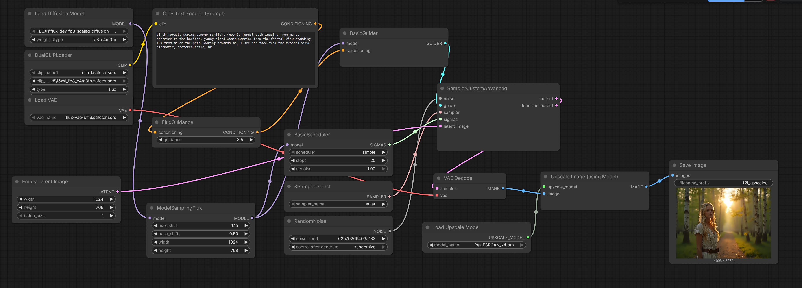
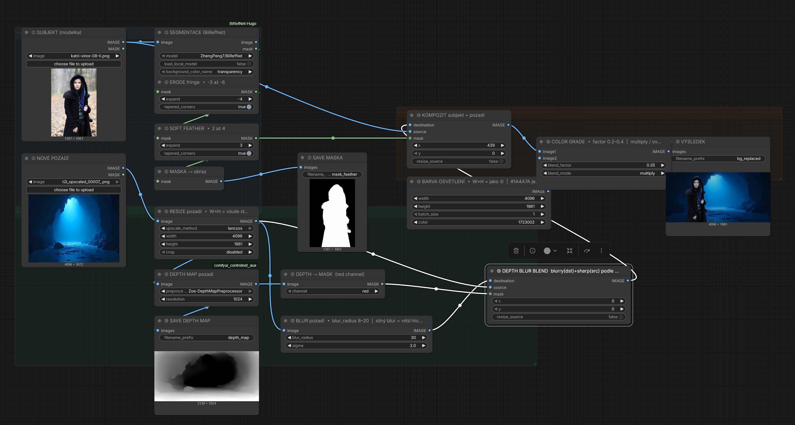
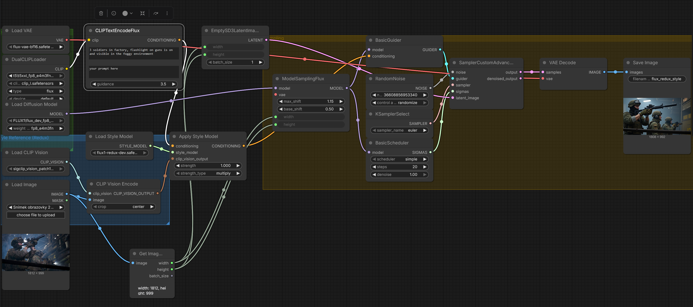

# Photo Edit ML Pipelines

## `flux_t2i_upscale_4x` 

text to image, generates image, upscales 4x, choose 1024x768 if you have low amount of vram on gpu

## `flux_bg_simple_relight_blur` 

 * choose foreground and background images, 
 * segment foreground, use mask, feather, save mask
 * play with resize, basically resize should match empty image scale (relight color)
 * depth map of background, save it
 * blur background (8-31), stack blurs if more blur is needed
 * composite them (choose x,y to place)
 * relight, using color (encode hex color into decimal)
 * blend it together (0.35, 0.4)

## `flux-redux-style`

 * choose the image, automatically determines image dimension
 * strenght param in ApplyStyle node reflects if prompt is suppressed (photo more like original) - 1.0, or lower values, more prompt emphasis (0.7)

